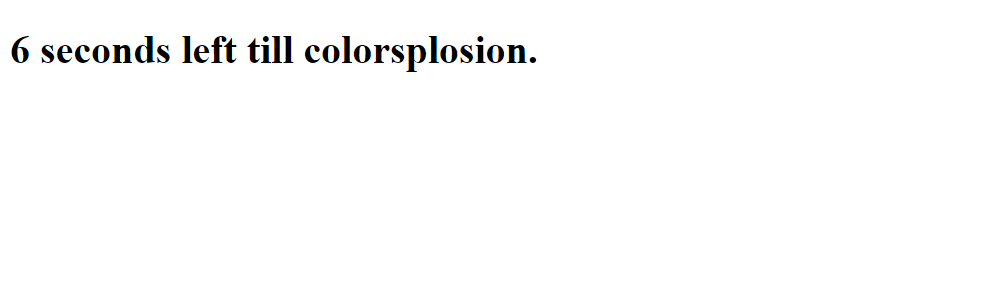

# JS-Countdown-Timer

Simple JavaScript Countdown Timer

<!-- Live link to deployed app -->

Repository: https://github.com/Mdudzik92/JS-Countdown-Timer 
Deployed app: https://mdudzik92.github.io/JS-Countdown-Timer/

<!-- Technologies used -->

JavaScript, HTML, DOM Manipulation

<!-- Explanation of what the app is -->

This is a simple timer app created with JavaScript using DOM Manipulation to access and write to a blank HTML file. The user opens the page and watches as the time counter decrements by one second at a time until a 'colorsplosion' photo appears. What's interesting about this is that there is nothing other than an ID and a class in the HTML before it is written via invoking the JS file's functionality.

<!-- Screenshot -->

<!-- License -->

MIT

<!-- Contact information -->

Email: mdudzik92@gmail.com
